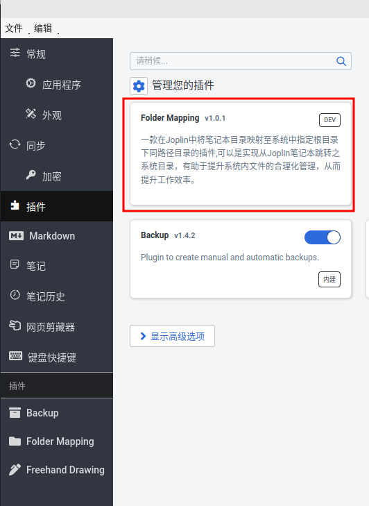
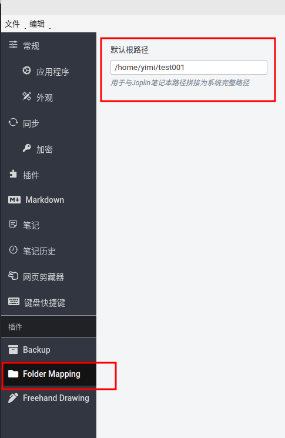
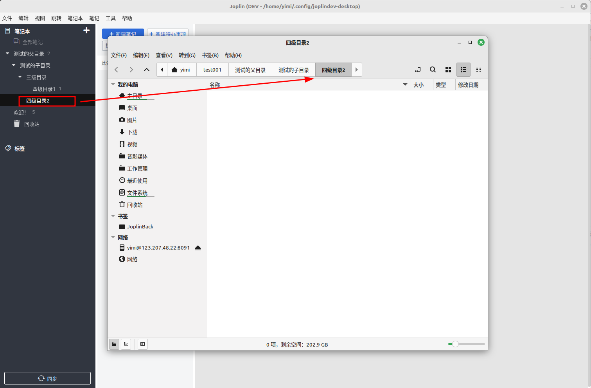

# Joplin Plugin

This is your new Joplin plugin. It is suggested that you use this README file to document your plugin.

For information on how to build or publish the plugin, please see [GENERATOR_DOC.md](./GENERATOR_DOC.md)

--- 

# 🔗 Joplin目录映射插件

**突破笔记与文件系统的次元壁，构建一体化数字工作流**  
*支持Windows/macOS/Linux系统深度整合*

---

这款专为 Joplin 笔记软件打造的插件，能够将 Joplin 中的笔记本目录精准映射到系统指定根目录下的同路径目录。借助该插件，用户可直接从 Joplin 笔记本跳转至对应的系统文件夹，轻松实现笔记目录管理与系统文件夹管理的深度融合，显著提升工作效率。

---

# 效果截图

## 安装后的插件

## 插件的配置

## 插件的使用

## 打开后的效果

